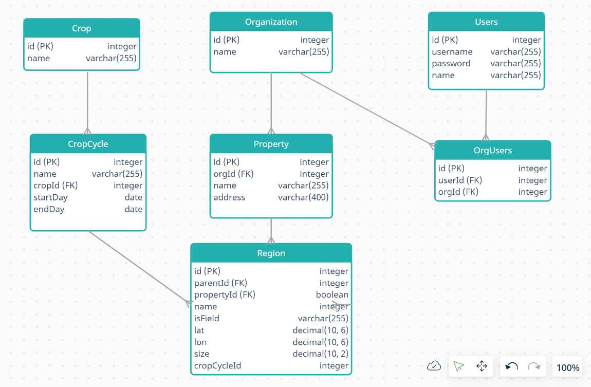

# crop-manager
NodeJS, Express, Oauth-2, PostgreSQL, Sequelize Demo

## Entity Relationship Diagram

## Local Setup
-   <code>git clone https://github.com/rohitkedari/crop-manager.git</code>: clone repo
-   <code>npm i</code>: install node dependency
-   install PostgreSQL and create DB crop_manager
-   update DB configuration in <code>config/confg.json</code> file for dev environment
-   <code>npx sequelize-cli db:migrate</code>: Run DB migration script
-   <code>npm start</code>: Start service in development and watch mode
-   refer [postman_collection.json](https://github.com/rohitkedari/crop-manager/blob/main/postman_collection.json) and execute REST APIs
-   Execute Create client API
-   Execute User signup API
-   Execute Get Oauth Token API
-   Use access_token received in above API to execute other secured APIs 
