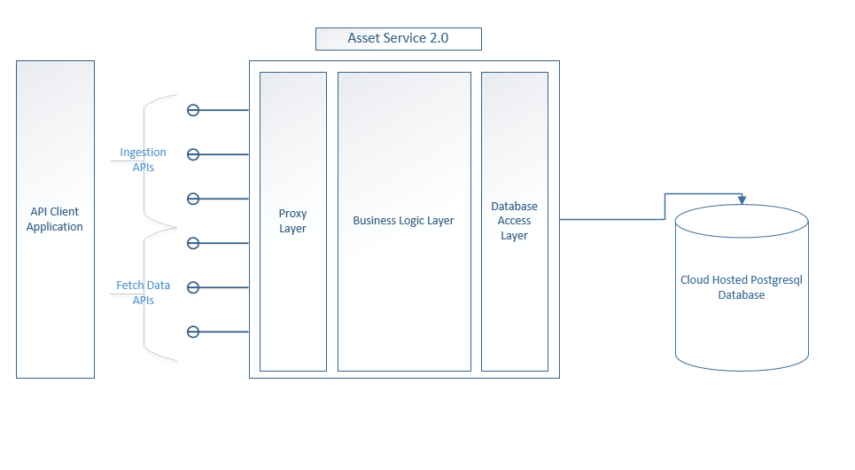

Asset service acts as a data storage and data access layer with single intention to perform various operations on asset configuration information.

Asset service is a microservice built using C# language and on .NET Core runtime. It is hierarchical in nature and one can create complex asset hierarchies and graph kind of a structures using this service.

